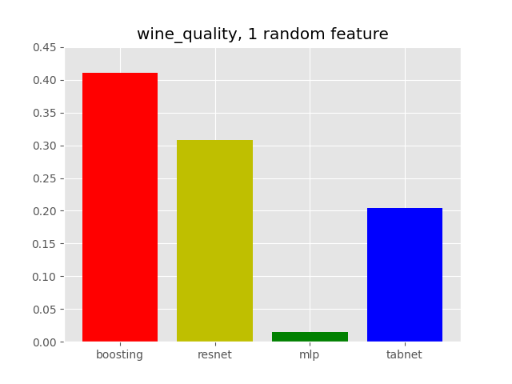
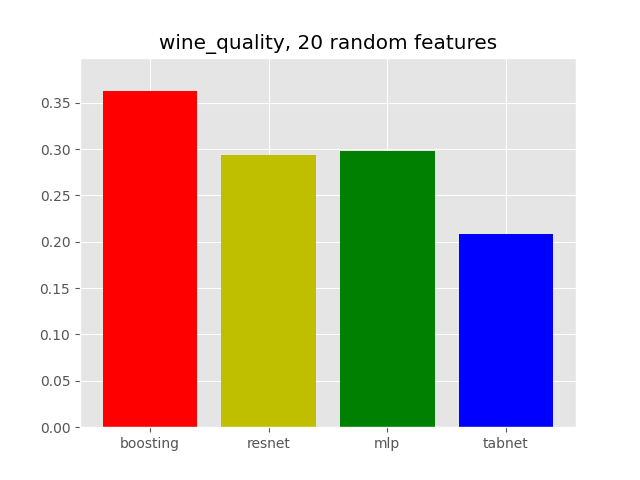

# Tabular: Deep learning models vs boostings
### По мотивам статьи [Why do tree-based models still outperform deep learning on typical tabular data?](https://hal.science/hal-03723551/document)

В этом репозитории я реализую и запускаю четыре вида моделей (Catboost, MLP, TabNet и ResNet) на нескольких задачах регрессии, предложенных авторами статьи. В качестве скоринга во всех датасетах используется `r2_score`. В качестве сравнения я использую неинформативные признаки (для наборов данных с `[1, 5, 20]_trash_features` в названии) и случайный поворот матрицы признаков (`_rotated`)

В отличие от авторов, использующих случайный поиск, я использую отбор гиперпараметров с помощью `Optuna`, что должно уменьшить число запусков до сходимости -- с 200 у авторов до 100 у меня. Логирование осуществляется в wandb, а также в папку `images_final`.

## Для запуска:
1. Установите зависимости: `pip3 install -r requirements.txt`
2. Выберите нужный конфиг (датасет, модель, число итераций отбора параметров) в теле файла `src/test.py`
3. Запустите обучение: `python3 src/test.py`
4. При необходимости, сгенерируйте новые данные с помощью файлов `src/make_rotation.py`, `src/make_trash_features.py`, добвьте новые модели (реализуйте новые функции `objective_XXX(trial)` в `src/test.py`)

## Результаты
### Сравннение моделей

#### Обычный датасет, без поворотов, без случайных признаков
wine | fifa
:-:|:-:
 | 

#### Датасет со случайным поворотом
wine | fifa
:-:|:-:
 | 

#### Датасет с одним случайным признаком
wine | fifa
:-:|:-:
 | 

#### Датасет с пятью случайными признаками
wine | fifa
:-:|:-:
 | 

#### Датасет с двадцатью случайными признаками
wine | fifa
:-:|:-:
 | 

#### Датасет с двадцатью случайными признаками и поворотом
wine | fifa
:-:|:-:
 | 

### Примеры запусков
    Boosting | MLP 
:-:|:-:
 |  
ResNet | TabNet
 |  |